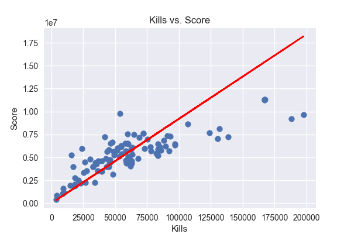

# Fortnite data explorations

This repo contains illustrates a very simple idea on how to automate the processs of running a ML pipeline using Luigi and modeling data using TensorFlow.

Once that all is done, the trained model is served as an API using TensorFlow Lite.

#### Main stack used

- Python 3.7+
- Flask
- TensorFlow 2.2
- Scrapy


## Idea [WIP]

I have recently started playing Fortnite, and I have been wondering how the score is defined and how some interesting variables (Fortnite stats) are relevant for this.

Anyway, this is still a WIP (Work In Progress), and so far I just wanted to check some relations between data. 

As you can see in the following plot, it seems to be a strong relationship between the number of kills and the score:

<center>
   
</center>

And until now, the first attempt (of course) is to fit a linear model $y = m*x + b$. For this I just created a simple neural network containing only one neuron. After training the model, the fitted line looks like this:

<center>
   
</center>

As I previously mentioned, this is still a WIP and I'll continue reporting in here some other interesting relations among the data.

## Setup

1. Create a virtual environment (I will use `conda`):
   ```bash
   conda create --name fortnite python=3.7
   ```
2. Activate the virtual environment:
   ```bash
   conda activate fortnite
   ```
3. Install requirements:
   ```bash
   pip install -r requirements.txt
   ```


## Get stuff working

#### Scraper

To run the scraper, you can simply run:
```bash
scrapy runspider -a filename=data.txt scraper.py
```

#### ML Pipeline

But, as we may prefer it would be better if we run the complete pipeline that does the following in this order:

1. Scrape data
2. Transform data (not used, so far)
3. Generate some plots that can be found in the[assets](https://github.com/RodolfoFerro/fortnite-stats-pipe/tree/master/assets) folder
4. Train a very simple model

To run the pipeline:
```bash
PYTHONPATH=. luigi --module tasks TrainModel --date 2020-07-16 --local-scheduler
```

You can also add all the custom tasks that you want!